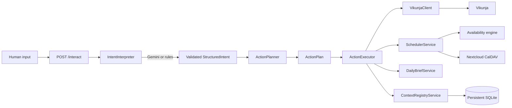

# Beacon Intake Architecture

Beacon turns natural language into deterministic operations while keeping model
output outside every side-effecting service boundary.

This document describes the legacy `/interact` interpretation path. The
bidirectional `/v1/conversation` path uses the conversational model's validated
Beacon function call directly as `StructuredIntent`; it does not feed model text
through this interpreter a second time. Both paths converge on
`InteractionService.execute_structured_intent`, `ActionPlanner`, and
`ActionExecutor`. See [Text conversation](docs/conversation.md).



## Component responsibilities

- `IntentInterpreter` is the provider-neutral protocol. It accepts text and
  returns a validated `StructuredIntent` or raises an interpreter error.
- `GeminiInterpreter` handles Gemini authentication, structured JSON requests,
  response extraction, Pydantic validation, and provider/network failures. It
  never receives service clients.
- `RuleBasedIntentInterpreter` is the offline/default narrow interpreter. It
  keeps local development and existing automations useful without an AI key.
- `StructuredIntent` describes the user's desired outcome, including
  `STORE_CONTEXT`, `QUERY_CONTEXT`, and `FORGET_CONTEXT` alongside the existing
  task, scheduling, brief, and unknown intents. Its fields are human concepts
  such as title, deadline, time constraint, and requested duration.
- `ActionPlanner` owns deterministic Beacon policy. It resolves supported
  relative-day constraints and turns intent into an ordered `ActionPlan`.
- `ActionExecutor` performs only the operations authorized by that plan. It
  coordinates Vikunja, the existing scheduler, the Daily Brief service, and the
  provider-neutral Context Registry service.
- `SchedulerService` remains the sole owner of availability ranking, calendar
  selection, duplicate prevention, and work-block create/update decisions.
- Vikunja and Nextcloud remain the systems of record.

## Request lifecycle

For `Schedule lighting paperwork tomorrow`:

1. The configured interpreter returns a validated scheduling intent. Gemini may
   preserve the phrase as
   `{"intent":"SCHEDULE_TASK","title":"Lighting paperwork","time_constraint":"tomorrow"}`;
   the rules interpreter resolves it directly into the equivalent `deadline`.
2. Pydantic rejects the response unless it satisfies `StructuredIntent`.
3. The planner converts `tomorrow` using Beacon's local date and produces two
   ordered actions: ensure/create the task, then schedule its work block.
4. The executor looks for one matching incomplete Vikunja task. It reuses a
   unique match, rejects multiple matches, or creates a task in the configured
   default Vikunja project.
5. The executor calls `SchedulerService` with the task and deterministic bounds
   (09:00–22:00 for the requested date).
6. The existing scheduler finds the best slot and creates, updates, leaves
   unchanged, or recommends a Nextcloud work block using its existing rules.
7. The response includes the accepted intent, the action plan, and an audit-like
   list of actions actually taken.

Task-only input such as `Buy Liquid IV tomorrow` plans only `CREATE_TASK`.
`UNKNOWN` plans only `REQUEST_CLARIFICATION` and performs no external calls.

## Gemini boundary

Gemini is an interchangeable parser, not an agent. Beacon sends the user text,
a narrow classification instruction, and the JSON schema for
`StructuredIntent`. Gemini may classify intent and extract a title, explicit
date, relative time phrase, duration, or clarification question.

Gemini cannot:

- choose Vikunja projects, calendars, or time slots;
- call Vikunja, CalDAV, or any Beacon service;
- decide whether a task match is safe;
- rank availability or apply duplicate policy;
- execute a mutation.

The adapter uses Gemini's `generateContent` structured-output request and then
validates the returned JSON independently. HTTP errors, missing candidate text,
malformed JSON, and semantically invalid intent all fail closed before planning.

## Action Planner policy

The planner is synchronous, deterministic, and free of network or AI calls:

| Intent | Planned operations |
|---|---|
| `CREATE_TASK` | Create a Vikunja task |
| `SCHEDULE_TASK` with title | Reuse one safe match or create a task; schedule it |
| `SCHEDULE_TASK` with task ID | Fetch/schedule that task |
| `CREATE_CALENDAR_EVENTS` | Expand one validated inclusive daily range into atomic fixed-time calendar actions |
| `BRIEF` | Generate the existing read-only Daily Brief |
| `UNKNOWN` | Return the interpreter's clarification question |

`today` and `tomorrow` are the only relative dates resolved in this first version.
Morning, afternoon, and evening deterministically narrow the window to 09:00–12:00,
12:00–17:00, and 17:00–22:00. Other constraints request clarification instead of
being guessed. A scheduled date otherwise uses the existing 09:00–22:00 policy
and the configured default duration. The planner does not inspect external
state; safe task matching occurs during execution and ambiguity stops the
workflow.

## Configuration

The default `BEACON_INTERPRETER=rules` requires no model credentials. To use
Gemini, set:

```dotenv
BEACON_INTERPRETER=gemini
GEMINI_API_KEY=replace-with-a-Google-AI-Studio-key
GEMINI_MODEL=gemini-3.5-flash
VIKUNJA_DEFAULT_PROJECT_ID=7
```

`GEMINI_API_BASE_URL` is optional and defaults to Google's v1beta API. The model
name is configurable so model changes do not affect Beacon's interfaces.
`VIKUNJA_DEFAULT_PROJECT_ID` is required only for flows that must create a task.
Tests inject fake HTTP and service clients and never require real credentials.

## Future extension points

- Implement another `IntentInterpreter` for OpenAI, Claude, or a local model and
  select it in the interpreter factory.
- Extend `StructuredIntent` with user concepts such as explicit priority or a
  richer time-window type, then add deterministic planner policy.
- Replace the initial relative-date parser with a deterministic temporal parser
  that can return clarification for unsupported phrases.
- Extend the conversation layer's persisted idempotency pattern to legacy intake
  before supporting retries or concurrent create requests there.
- Add confirmation policy for higher-impact action types without changing any
  interpreter adapter.
