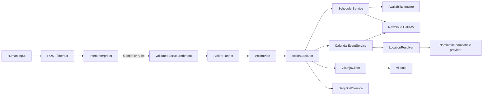

# Beacon Intake Architecture

Beacon turns natural language into deterministic operations while keeping model
output outside every side-effecting service boundary.



## Component responsibilities

- `IntentInterpreter` is the provider-neutral protocol. It accepts text and
  returns a validated `StructuredIntent` or raises an interpreter error.
- `GeminiInterpreter` handles Gemini authentication, structured JSON requests,
  response extraction, Pydantic validation, and provider/network failures. It
  never receives service clients.
- `RuleBasedIntentInterpreter` is the offline/default narrow interpreter. It
  keeps local development and existing automations useful without an AI key.
- `StructuredIntent` describes the user's desired outcome:
  `CREATE_CALENDAR_EVENT`, `CREATE_TASK`, `SCHEDULE_TASK`, `BRIEF`, or
  `UNKNOWN`. Its entity fields are human concepts
  such as clean title, raw location query, description, deadline, time
  constraint, and requested duration. It does not contain provider payloads.
- `ActionPlanner` owns deterministic Beacon policy. It resolves supported
  relative-day constraints and turns intent into an ordered `ActionPlan`.
- `ActionExecutor` performs only the operations authorized by that plan. It
  coordinates Vikunja, fixed events, the existing scheduler, and Daily Brief.
- `SchedulerService` remains the sole owner of availability ranking, calendar
  selection, duplicate prevention, and work-block create/update decisions.
- `CalendarEventService` separately owns deterministic fixed-event validation,
  theater/school/personal routing, exact duplicate detection, overlap warnings,
  location-resolution outcomes, and ordinary CalDAV event creation.
- `LocationResolver` owns provider-neutral deterministic candidate selection.
  `NominatimLocationProvider` only performs and normalizes external search.
- Vikunja and Nextcloud remain the systems of record.

## Request lifecycle

For `Schedule lighting paperwork tomorrow`:

1. The configured interpreter returns a validated scheduling intent. Gemini may
   preserve the phrase as
   `{"intent":"SCHEDULE_TASK","title":"Lighting paperwork","time_constraint":"tomorrow"}`;
   the rules interpreter resolves it directly into the equivalent `deadline`.
2. Pydantic rejects the response unless it satisfies `StructuredIntent`.
3. The planner converts `tomorrow` using Beacon's local date and produces two
   ordered actions: ensure/create the task, then schedule its work block.
4. The executor looks for one matching incomplete Vikunja task. It reuses a
   unique match, rejects multiple matches, or creates a task in the configured
   default Vikunja project.
5. The executor calls `SchedulerService` with the task and deterministic bounds
   (09:00–22:00 for the requested date).
6. The existing scheduler finds the best slot and creates, updates, leaves
   unchanged, or recommends a Nextcloud work block using its existing rules.
7. The response includes the accepted intent, the action plan, and an audit-like
   list of actions actually taken.

Task-only input such as `Buy Liquid IV tomorrow` plans only `CREATE_TASK`.
`UNKNOWN` plans only `REQUEST_CLARIFICATION` and performs no external calls.

A fixed commitment such as `AD Players focus call for Holly Street on Monday
8/10 from 10:00-18:00` plans only `CREATE_CALENDAR_EVENT`. It never creates a
Vikunja task and never enters the work-block scheduler. The deterministic event
service receives clean title `Focus call for Holly Street` and raw location query
`AD Players`, requires both bounds, routes the event, checks duplicates, resolves
the venue when enabled, checks overlaps, and writes a normal event without a
Vikunja marker. Ambiguous places return candidates without mutation; no-match or
provider failure preserves the raw venue and warns.

## Gemini boundary

Gemini is an interchangeable parser, not an agent. Beacon sends the user text,
a narrow classification instruction, and the JSON schema for
`StructuredIntent`. Gemini may classify intent and extract a clean title, raw
location query, user-supplied description, explicit date, relative time phrase,
duration, or clarification question. It cannot supply a resolved address.

Gemini cannot:

- choose Vikunja projects, concrete calendar names, or time slots;
- bypass deterministic fixed-event routing with an arbitrary destination;
- call Vikunja, CalDAV, or any Beacon service;
- decide whether a task match is safe;
- rank availability or apply duplicate policy;
- call a geocoder, invent an address, or select a place candidate;
- execute a mutation.

The adapter uses Gemini's `generateContent` structured-output request and then
validates the returned JSON independently. HTTP errors, missing candidate text,
malformed JSON, and semantically invalid intent all fail closed before planning.

## Action Planner policy

The planner is synchronous, deterministic, and free of network or AI calls:

| Intent | Planned operations |
|---|---|
| `CREATE_CALENDAR_EVENT` | Validate, route, de-duplicate, and create one normal calendar event |
| `CREATE_TASK` | Create a Vikunja task |
| `SCHEDULE_TASK` with title | Reuse one safe match or create a task; schedule it |
| `SCHEDULE_TASK` with task ID | Fetch/schedule that task |
| `BRIEF` | Generate the existing read-only Daily Brief |
| `UNKNOWN` | Return the interpreter's clarification question |

`today` and `tomorrow` are the only relative dates resolved in this first version.
Morning, afternoon, and evening deterministically narrow the window to 09:00–12:00,
12:00–17:00, and 17:00–22:00. Other constraints request clarification instead of
being guessed. A scheduled date otherwise uses the existing 09:00–22:00 policy
and the configured default duration. The planner does not inspect external
state; safe task matching occurs during execution and ambiguity stops the
workflow.

For fixed events, the planner preserves the interpreter's start, optional end,
and optional duration without inventing values. `CalendarEventService` applies
the sole deterministic bound policy before duplicate lookup or side effects:
explicit end, else explicit duration, else exactly one hour after the required
start. Invalid explicit chronology is rejected rather than defaulted.

## Configuration

The default `BEACON_INTERPRETER=rules` requires no model credentials. To use
Gemini, set:

```dotenv
BEACON_INTERPRETER=gemini
GEMINI_API_KEY=replace-with-a-Google-AI-Studio-key
GEMINI_MODEL=gemini-3.5-flash
VIKUNJA_DEFAULT_PROJECT_ID=7
```

`GEMINI_API_BASE_URL` is optional and defaults to Google's v1beta API. The model
name is configurable so model changes do not affect Beacon's interfaces.
`VIKUNJA_DEFAULT_PROJECT_ID` is required only for flows that must create a task.
Tests inject fake HTTP and service clients and never require real credentials.

## Future extension points

- Implement another `IntentInterpreter` for OpenAI, Claude, or a local model and
  select it in the interpreter factory.
- Extend `StructuredIntent` with user concepts such as explicit priority or a
  richer time-window type, then add deterministic planner policy.
- Replace the initial relative-date parser with a deterministic temporal parser
  that can return clarification for unsupported phrases.
- Add persisted idempotency and a task-intake marker before supporting retries or
  concurrent create requests.
- Add confirmation policy for higher-impact action types without changing any
  interpreter adapter.
