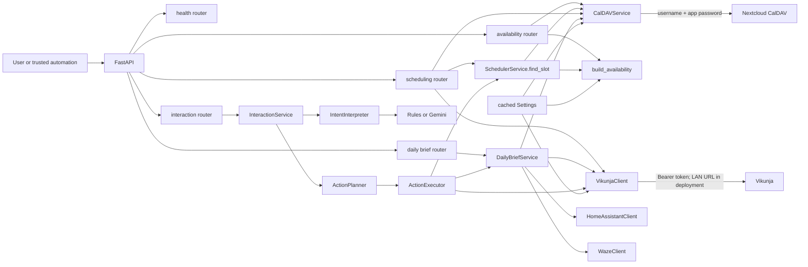

# Architecture

See [Scheduling](scheduling.md), [Integrations](integrations.md), [Data models](data-models.md), and [Decisions](decisions.md).

`app.main:app` constructs FastAPI 0.116.1, advertises version `0.3.0`, validates
configuration during startup, and mounts the legacy versioned APIs plus the
top-level interaction interface. Synchronous route functions construct services
per request. `pydantic-settings` loads configuration and `get_settings()` caches
it process-wide.

## Responsibilities

- `app/main.py`: application metadata and router mounting.
- `app/api/health.py`: public liveness response.
- `app/api/availability.py`: authenticated availability orchestration and calendar-error mapping.
- `app/api/scheduling.py`: thin task-retrieval/scheduler invocation and HTTP error mapping.
- `app/api/daily_brief.py`: authenticated date query and Daily Brief invocation/error mapping.
- `app/api/interface.py`: stable `/interact`, `/brief`, and `/status` boundaries.
- `app/models.py`: Pydantic request, response, integration, and interval models.
- `app/config.py`: environment settings and comma-separated calendar parsing.
- `app/security.py`: exact API-key header comparison.
- `app/services/availability.py`: deterministic interval and scoring logic.
- `app/services/caldav_client.py`: calendar discovery, busy reads with task exclusion, duplicate search, in-place event writes.
- `app/services/vikunja_client.py`: task retrieval and normalization.
- `app/services/daily_brief.py`: read-only collection, prioritization, conflict detection, summaries, and graceful degradation.
- `app/services/interaction.py`: thin interpreter/planner/executor orchestrator.
- `app/intake/rules.py`: narrow offline interpreter used by default.
- `app/intake/gemini.py`: Gemini structured-output adapter and fail-closed validation.
- `app/intake/planner.py`: deterministic intent-to-action policy.
- `app/intake/executor.py`: ordered service execution with safe task reuse.
- `app/services/home_assistant_client.py`: weather entity normalization.
- `app/services/waze_client.py`: direct Waze travel normalization.
- `app/services/scheduler.py`: deterministic lifecycle orchestration; `find_slot` remains the availability boundary and `schedule_task` owns create/compare/update decisions.

## Boundaries and state

`SchedulerService.find_slot(task, request, exclude_task_id=None)` remains the slot-finding boundary. `SchedulerService.schedule_task(task, request)` now owns lifecycle business logic: resolve bounds, locate the linked event, exclude it from conflicts, choose `availability.options[0]`, and create, skip, update, or recommend. The route does not make scheduling decisions.

`GET /health` is public. All business endpoints require `X-Beacon-API-Key`;
missing or mismatched credentials are `401`. There is no internal persistence:
Vikunja and Nextcloud are systems of record, and descriptions are the only
task/event link. Search/create/update is not transactional, so concurrent
requests can race.

The Docker image uses Python 3.12 slim, installs pinned requirements, copies `app/`, exposes 8000, and starts Uvicorn. Compose passes settings from the host and restarts unless stopped.
