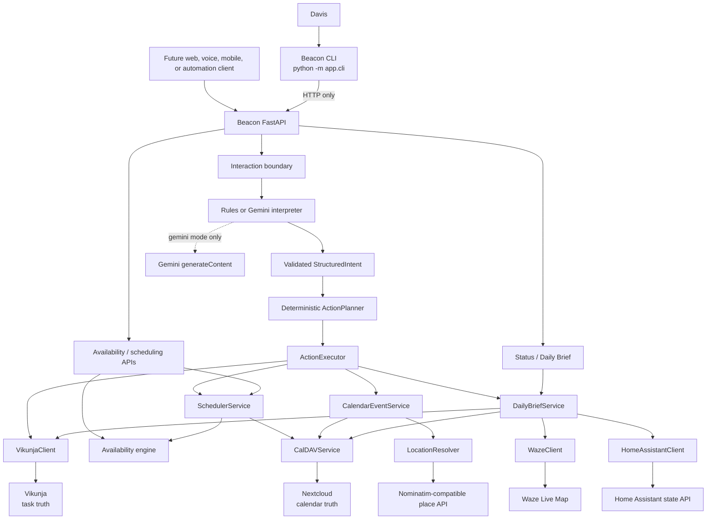

# Architecture

Beacon separates user interfaces, interpretation, deterministic decisions, and
external-system execution. The central rule is:

> AI may interpret. Beacon validates, plans, and decides. Integration adapters
> execute. Vikunja and Nextcloud remain sources of truth.

See [Interaction](interaction.md), [Scheduling](scheduling.md),
[Integrations](integrations.md), [Data models](data-models.md), and
[Architecture decisions](decisions.md) for the detailed contracts.

## System context



The CLI is deliberately replaceable. It does not import intake, planning,
scheduling, or integration services. A future interface can call the same API
without changing Beacon's business behavior.

## Runtime composition

`app.main:app` constructs FastAPI 0.116.1 and advertises the version from
`app/version.py` (currently `0.3.0`). The application mounts:

| Router | Mounted path | Authentication | Responsibility |
|---|---|---|---|
| `app.api.health` | `/health` | public | Process liveness only. |
| `app.api.interface` | `/interact`, `/brief`, `/status` | API key | Stable human/automation-facing interface. |
| `app.api.availability` | `/v1/availability` | API key | Explicit availability calculation. |
| `app.api.scheduling` | `/v1/schedule/task/{task_id}` | API key | Explicit task scheduling lifecycle. |
| `app.api.daily_brief` | `/v1/brief/daily` | API key | Versioned Daily Brief endpoint. |

Routes are synchronous. They construct service objects per request, delegate,
and translate typed exceptions to HTTP responses. `pydantic-settings` reads
environment variables and an optional `.env`; `get_settings()` caches the first
settings object process-wide.

The FastAPI lifespan validates the configured timezone and calendar list. It
also rejects Gemini mode without `GEMINI_API_KEY`. Pydantic settings validation
rejects missing required values before the service can start.

## Component responsibilities

### Interface and transport

- `app/cli/`: standard-library HTTP client, terminal REPL, one-shot commands,
  response presentation, and user-facing transport errors. It contains no
  Beacon decision logic.
- `app/main.py`: FastAPI metadata, lifespan validation, and router mounting.
- `app/api/*.py`: request validation boundary, authentication dependencies,
  service invocation, and HTTP error mapping.
- `app/security.py`: constant-time comparison of `X-Beacon-API-Key` with the
  configured key. It implements one shared key, not users, roles, or scopes.

### Intake and deterministic execution

- `app/services/interaction.py`: selects the configured interpreter, obtains a
  validated intent, invokes the planner, and passes the plan to the executor.
- `app/intake/interpreter.py`: provider-neutral interpreter protocol and typed
  interpreter errors.
- `app/intake/rules.py`: narrow deterministic offline grammar; the default.
- `app/intake/gemini.py`: optional Gemini structured-output adapter. It receives
  text and a JSON schema but no integration client or service credential.
- `app/intake/planner.py`: pure intent-to-action policy, including supported
  relative dates, part-of-day windows, and clarification for unsupported time
  constraints.
- `app/intake/executor.py`: executes only planned actions, resolves safe task
  reuse, delegates fixed events, scheduling, and brief generation, and creates
  response data.

### Domain services

- `app/services/availability.py`: deterministic interval merging, candidate
  generation, scoring, and sorting.
- `app/services/scheduler.py`: owns bounds, destination selection, duplicate
  lifecycle, selected-slot choice, and create/update/no-op/recommendation
  decisions.
- `app/services/calendar_events.py`: owns fixed-event validation, deterministic
  category routing, exact duplicate detection, location-resolution outcomes,
  cross-calendar overlap warnings, and normal-event CalDAV creation.
- `app/services/location.py`: provider-neutral resolver/provider protocols,
  deterministic candidate ranking, confidence/ambiguity policy, and resolver
  construction from settings.
- `app/services/daily_brief.py`: read-only aggregation, task ordering, travel and
  overlap conflict detection, partial-failure warnings, and deterministic text.

### External adapters

- `app/services/vikunja_client.py`: task retrieval, paging, normalization, and
  task creation in the configured default project.
- `app/services/caldav_client.py`: calendar discovery, event/busy reads, exact
  task-marker and fixed-event lookup, normal/work-block creation, and verified
  in-place updates.
- `app/services/waze_client.py`: optional travel-time and distance normalization.
- `app/services/home_assistant_client.py`: optional read of one weather entity.
- `app/services/nominatim.py`: Nominatim-compatible HTTP search and normalization
  into vendor-neutral location candidates; it does not select a winner.

## Request paths

### Natural-language interaction

```text
CLI or HTTP caller
  -> POST /interact
  -> InteractRequest validation and API-key check
  -> configured IntentInterpreter
  -> validated StructuredIntent
  -> deterministic ActionPlanner
  -> ActionPlan
  -> ActionExecutor
  -> Vikunja / CalendarEventService / SchedulerService / DailyBriefService
  -> InteractResponse
  -> client formatting
```

No interpreter can invoke integrations. Even in Gemini mode, model output is
validated as `StructuredIntent` before the planner sees it. The planner, not the
model, chooses allowed operations and supported scheduling windows.

Fixed commitments follow the same path. The interpreter supplies typed event
facts; the planner authorizes one event action; `CalendarEventService` validates
times, chooses a configured category calendar deterministically, detects exact
duplicates, resolves an optional physical venue through `LocationResolver`,
checks overlaps, then uses the shared CalDAV adapter. Ambiguous places clarify
without mutation; lookup failure falls back to the raw venue. The availability
engine is not involved and the event carries no Vikunja task marker.

### Explicit scheduling

```text
POST /v1/schedule/task/{id}
  -> VikunjaClient.get_task
  -> SchedulerService.schedule_task
  -> exact marker lookup in destination calendar
  -> busy-calendar retrieval
  -> deterministic availability ranking
  -> create / update / unchanged / recommendation decision
  -> CalDAV write only when required
```

### Daily Brief

```text
GET /brief or GET /v1/brief/daily
  -> DailyBriefService
  -> calendar events + Vikunja tasks
  -> optional Waze and Home Assistant reads
  -> deterministic groups, conflicts, warnings, summary
  -> no mutations
```

## State and ownership

Beacon has no internal database.

| State | Owner |
|---|---|
| Tasks, completion, due dates, priorities | Vikunja |
| Calendar events and availability | Nextcloud/CalDAV |
| Task-to-work-block link | Exact `Vikunja task ID: <id>` line in event description |
| Runtime configuration and secrets | Environment or uncommitted `.env` |
| Request/response data | In memory for the lifetime of a request |
| Place candidates and resolution evidence | In memory for the lifetime of a request; external provider remains its own data controller |

`get_settings()` is cached, but this is configuration caching rather than
durable domain state. `actions_taken` is returned to the caller and is not an
audit log.

The editable description marker avoids an internal linkage database but is
best-effort: manual edits, calendar moves, finite lookup windows, and concurrent
requests can defeat idempotency. Search/create/update is not transactional.

## Security boundary

- `/health` is intentionally public and reveals only `status` and service name.
- Every other documented application endpoint requires
  `X-Beacon-API-Key`; a missing or incorrect key returns `401`.
- `/status` exposes configuration-safe booleans and names, never credentials.
- The one API key grants all protected endpoint access; there are no read/write
  scopes or per-client identities.
- Gemini receives its own API key, user text, instructions, and an intent JSON
  schema. It does not receive Vikunja, Nextcloud, Home Assistant, or Beacon keys.
- When physical lookup is explicitly enabled, the configured place endpoint
  receives only the raw venue query plus geographic bias and the configured user
  agent. It does not receive event description, calendar contents, Beacon API
  key, or integration credentials. Virtual locations never trigger lookup.
- The CLI reads its Beacon key from `BEACON_API_KEY` or `--api-key`, never stores
  it, and does not print it. Environment configuration is preferred because a
  command-line key may appear in shell history or process listings.

## Deployment boundary

The Docker image uses Python 3.12 slim, installs pinned dependencies, copies only
`app/`, exposes port 8000, and launches Uvicorn on `0.0.0.0:8000`. Its health
check calls `http://127.0.0.1:8000/health` every 30 seconds after a 15-second
start period.

Compose runs one `beacon-api` service with PID initialization,
`restart: unless-stopped`, port `8000:8000`, a 20-second stop grace period, and
environment values supplied from the host. It does not run Vikunja, Nextcloud,
Home Assistant, or a database.

Container health proves only that the HTTP process answers `/health`; it does
not prove that external integrations are reachable. `/status` similarly reports
configuration, not live dependency health. A Daily Brief or explicit operation
is required to observe integration behavior.

## Deliberately absent capabilities

The repository currently has no:

- internal database, persistent idempotency journal, or durable audit trail;
- background worker, automatic trigger, watcher, polling loop, or retries;
- automatic Daily Brief delivery, reminder delivery, or voice synthesis;
- n8n workflow, native mobile app, dedicated web UI, or inbound Home Assistant
  command integration;
- task completion/update/delete command;
- automatic conflict repair or multi-block task splitting.

These absences are intentional boundaries, not hidden behavior. See the
[Roadmap](roadmap.md) for planned and speculative directions.
