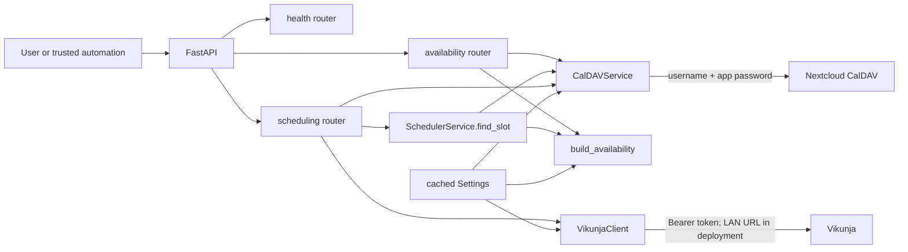

# Architecture

See [Scheduling](scheduling.md), [Integrations](integrations.md), [Data models](data-models.md), and [Decisions](decisions.md).

`app.main:app` constructs FastAPI 0.116.1, advertises version `0.2.0`, and mounts three routers. Synchronous route functions construct services per request. `pydantic-settings` loads configuration and `get_settings()` caches it process-wide.

## Responsibilities

- `app/main.py`: application metadata and router mounting.
- `app/api/health.py`: public liveness response.
- `app/api/availability.py`: authenticated availability orchestration and calendar-error mapping.
- `app/api/scheduling.py`: scheduling lifecycle, first-option selection, destination resolution, duplicate lookup, event creation, HTTP error mapping.
- `app/models.py`: Pydantic request, response, integration, and interval models.
- `app/config.py`: environment settings and comma-separated calendar parsing.
- `app/security.py`: exact API-key header comparison.
- `app/services/availability.py`: deterministic interval and scoring logic.
- `app/services/caldav_client.py`: calendar discovery, busy reads, duplicate search, event writes.
- `app/services/vikunja_client.py`: task retrieval and normalization.
- `app/services/scheduler.py`: validation, bounds, busy retrieval, availability via `find_slot`.

## Boundaries and state

`SchedulerService` exposes `find_slot(task, request)`, not `schedule_task()`. It returns `AvailabilityResponse`. The route function named `schedule_task` selects `availability.options[0]`, resolves the destination, checks duplicates, and optionally creates an event.

`GET /health` is public. Both business endpoints require `X-Beacon-API-Key`; mismatch is `401`. There is no internal persistence: Vikunja and Nextcloud are systems of record, and descriptions are the only task/event link. Search-before-create is not atomic, so concurrent requests can race.

The Docker image uses Python 3.12 slim, installs pinned requirements, copies `app/`, exposes 8000, and starts Uvicorn. Compose passes settings from the host and restarts unless stopped.
