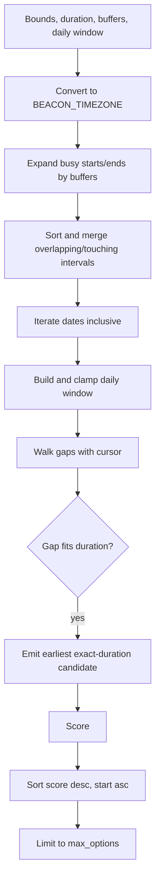

# Availability engine

`app/services/availability.py` converts busy intervals into ranked options. See [Data models](data-models.md).

Request bounds/events are converted using `astimezone(ZoneInfo(BEACON_TIMEZONE))`. Each busy interval becomes `(start - before, end + after)`. Intervals sort by start and merge when the next start is `<=` current end. Metadata is discarded during merging.

Every date from earliest through deadline is considered. `daily_start`/`daily_end` split once on `:` and construct `time`; there is no model-level format validation. Each daily window is clamped to global bounds. Overnight/reversed windows produce no usable opening. The cursor begins at window start, and only the earliest exact-duration candidate in each free gap is emitted. Buffers expand busy time, not candidates.

## Exact scoring

1. Base `100.0`; reason `fits requested duration`.
2. Compute fractional `days_out = max(0, (start-earliest).total_seconds()/86400)`; subtract `3 * days_out`.
3. Local start hour 9 through 16: add `10`; reason `daytime opening`.
4. Local start hour 20 or later: subtract `15`; reason `late-evening penalty`.
5. At least one hour between candidate end and that day's clamped window end: add `5`; reason `leaves at least one hour of flexibility`.
6. Round to one decimal.

Sort is score descending, then start ascending. Return `candidates[:max_options]`. `events_found` is the unmerged input count; `no_availability` reflects whether any candidate existed before truncation.

Scoring is fixed and ignores task priority, labels, project, title, and description. There is no task splitting, multi-block allocation, calendar weighting, preference learning, or persistent history. Scheduling requests 10 options; the public model defaults to 3 and allows 1–20.
