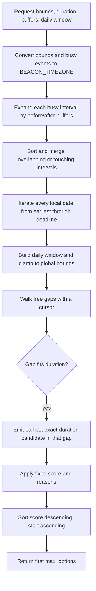

# Availability engine

`app/services/availability.py` converts explicit bounds plus CalDAV busy
intervals into ranked exact-duration options. It is deterministic: it performs no
network I/O, creates no events, and uses no AI. `CalDAVService` supplies the busy
data before this function is called.

See [Data models](data-models.md), [Scheduling](scheduling.md), and
[API reference](api-reference.md).



## Inputs and validation

`AvailabilityRequest` requires aware or parseable datetimes `earliest_iso` and
`deadline_iso`, with deadline strictly after earliest. Duration must be `1..1440`
minutes. Buffers are independently `0..720`; `max_options` is `1..20`.

`daily_start` and `daily_end` default to `09:00` and `22:00` but are plain strings
at model validation time. The engine splits each once at `:` and passes integers
to `datetime.time`. Invalid formats therefore fail during execution, with HTTP
mapping dependent on the calling route.

The public `/v1/availability` request defaults buffers to zero. Scheduling uses
`ScheduleTaskRequest`, whose defaults are 15 minutes before and after, and asks
the availability engine for up to 10 options internally.

## Timezone normalization

The engine obtains `BEACON_TIMEZONE` from cached settings and calls `astimezone`
for request bounds and every busy interval. Normal operation should provide
timezone-aware ISO-8601 values. CalDAV normalization produces aware values before
the engine sees them.

Daily windows are constructed directly in Beacon's zone. This makes day
iteration local-calendar based and allows UTC offsets to change across a DST
boundary.

## Busy intervals and buffers

Each input interval becomes:

```text
(event.start - buffer_before, event.end + buffer_after)
```

The expanded intervals sort by start and merge when the next start is less than
or equal to the current merged end. Thus overlapping and exactly touching busy
regions become one region. Calendar/title metadata is intentionally discarded
during merging because the output needs only free-time geometry.

Buffers expand busy time; they do not lengthen candidate events. A 60-minute
request always produces a 60-minute option.

`events_found` reports the number of input intervals before buffering/merge, not
the number of merged regions and not the number of raw CalDAV resources skipped
during normalization.

## Candidate generation

The engine considers every local date from `earliest.date()` through
`deadline.date()`, inclusive.

For each date:

1. Construct the configured local daily start/end.
2. Clamp the start upward to global `earliest`.
3. Clamp the end downward to global `deadline`.
4. Start a cursor at the clamped window start.
5. Walk merged busy regions in order.
6. When the gap before a busy region is at least the requested duration, emit one
   candidate beginning exactly at the cursor.
7. Advance the cursor through busy time.
8. After all relevant busy regions, emit one candidate at the cursor if it fits
   before the daily end.

Only the earliest exact-duration candidate in each free gap is emitted. The
engine does not generate every possible minute offset within a long opening.
This keeps the result small and makes the fixed ranking predictable.

If the daily window is reversed/overnight, or clamping makes its end no later
than its start, it yields no candidate. Overnight windows are not split across
dates.

## Exact scoring

For candidate start `start`, end `end`, global local lower bound `earliest`, and
that day's clamped `window_end`:

1. Begin at `100.0` and add reason `fits requested duration`.
2. Compute fractional
   `days_out = max(0, (start - earliest).total_seconds() / 86400)` and subtract
   `3 * days_out`.
3. If local start hour is 09 through 16, add `10` and reason
   `daytime opening`.
4. If local start hour is 20 or later, subtract `15` and reason
   `late-evening penalty`.
5. If at least one hour remains between candidate end and the clamped daily end,
   add `5` and reason `leaves at least one hour of flexibility`.
6. Round to one decimal.

Sort order is score descending and then start ascending. Stable model output is
`candidates[:max_options]`. `no_availability` reflects whether any candidate was
generated before truncation.

## Calendar semantics

`calendars_checked` is the requested calendar list, or configured defaults when
the request value is null/empty. It reports intended names, not a verified list
of calendars discovered from Nextcloud. CalDAV busy retrieval silently skips
requested names that do not match a principal calendar, so this field must not be
treated as integration-health proof.

For rescheduling only, `SchedulerService` passes the current task ID to CalDAV
busy retrieval when one linked work block exists. Every event containing that
exact task-marker line is omitted before availability calculation so the block
does not occupy its own candidate time. Public availability requests do not use
this exclusion.

## Example

Given a 09:00–17:00 window, 60-minute duration, and buffered busy regions
10:00–11:00 and 13:00–14:00, the engine emits starts at 09:00, 11:00, and 14:00.
It does not also emit 11:01, 11:15, or 15:00. Scoring may rank those emitted
options differently, but candidate construction always chooses each gap's first
fit.

## Explicit non-goals and limitations

Scoring ignores task priority, labels, project, title, description, user history,
calendar identity, travel, energy, and preference learning. There is no:

- task splitting or multiple blocks;
- calendar weighting;
- optimization across several tasks;
- persistent availability cache/history;
- rounding to fixed clock increments;
- overnight-window support;
- model-level `HH:MM` validation;
- exhaustive enumeration within a free gap.

These constraints are deliberate and keep slot selection explainable and
testable.
