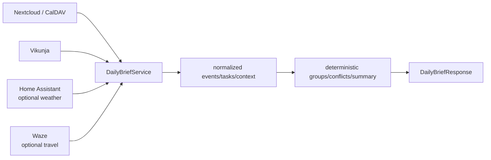

# Daily Brief

`GET /brief` and `GET /v1/brief/daily` answer “What does Davis need to know
right now?” through deterministic, read-only orchestration. The top-level path is
the stable client/automation alias; both invoke the same service behavior.

Daily Brief never creates, updates, deletes, completes, or schedules anything.
It does not invoke the configured intake interpreter, ask Gemini to summarize,
generate speech audio, forecast weather, perform navigation, or repair conflicts.



## Request and date boundary

The optional query is `date=YYYY-MM-DD`. Omission uses the current date in
`BEACON_TIMEZONE`. Beacon constructs the local half-open range from midnight at
the target date through midnight the next day.

`generated_at` is the actual generation time in Beacon's timezone even when the
requested date is in the past or future. This distinction affects `next_event`
and passed leave-by detection.

## Lifecycle

1. Resolve timezone, generation time, target date, and local day bounds.
2. Fetch configured calendar events. Normalize/sort them and separate exact-marker
   Beacon work blocks from ordinary events.
3. List Vikunja tasks. Ignore completed tasks and build overdue, due-today, and
   highest-priority views.
4. If travel is enabled, compute home-to-event estimates for located events and
   travel feasibility for adjacent located events.
5. If weather is enabled, read one Home Assistant weather entity.
6. Detect ordinary overlaps, work-block overlaps, passed leave-by times, and
   insufficient sequential travel time.
7. Build structured headline values and deterministic `spoken_summary` text.

## Calendar classification

Calendar events are sorted by start, end, case-folded calendar, then case-folded
title. An event is a Beacon work block when its description contains a line
beginning exactly with `Vikunja task ID: ` followed only by digits. Work blocks
are returned separately in `calendar.work_blocks`; other events are in
`calendar.events`.

The source `description`, `location`, all-day status, UID, calendar, title, and
timezone-aware bounds remain available in the typed event model.

## Task grouping and priority

Completed tasks never appear. Due dates are interpreted in Beacon's timezone;
naive Vikunja datetimes are assumed to be in that timezone.

- `overdue`: local due date before the target date;
- `due_today`: local due date equal to the target date;
- `highest_priority`: minimum by this explicit ordering:
  1. priority descending;
  2. due timestamp ascending, with no due date last;
  3. task ID ascending.

`highest_priority` is chosen from every incomplete task, not only overdue or
due-today tasks.

## Next event

`summary.next_event` excludes Beacon work blocks.

- For today's brief, it is the first ordinary event whose end is after
  `generated_at`; an already-started event may therefore be next.
- For a past/future date, it is the first ordinary event.
- With no ordinary events, it is `null`.

## Travel

Travel requires `DAILY_BRIEF_TRAVEL_ENABLED=true` and a non-empty
`BEACON_HOME_LOCATION`. Missing home configuration produces a warning rather
than an exception.

For every event or work block with a non-empty location, Beacon requests a
home-to-event Waze estimate. Leave-by time is:

```text
event start - route duration - DAILY_BRIEF_TRAVEL_BUFFER_MINUTES
```

A leave-by time strictly before `generated_at` creates `LEAVE_BY_PASSED`.

For sequential feasibility, Beacon examines adjacent events in the complete
sorted event list (ordinary events and work blocks). It checks a pair only when
both have locations. It does not skip an intervening locationless event to
compare non-adjacent located events. A conflict exists when:

```text
previous end + Waze travel minutes > current start
```

Waze uses an unofficial Live Map dependency. Failures become warnings and do not
remove calendar/task data.

## Weather

Weather requires `DAILY_BRIEF_WEATHER_ENABLED=true`. The adapter reads exactly
one configured Home Assistant entity and returns its current condition and
optional temperature, unit, humidity, and observation time. It does not retrieve
a forecast or control Home Assistant.

Disabled weather yields `weather: null` without a warning. Enabled but
misconfigured/unavailable weather yields `weather: null` plus a warning.

## Conflict detection

Conflicts are informational; Beacon never changes the calendar in response.

| Type | Condition |
|---|---|
| `OVERLAPPING_EVENTS` | Two overlapping events have the same work-block classification (both ordinary or both marked). |
| `WORK_BLOCK_OVERLAP` | Exactly one of two overlapping events is a Beacon work block. |
| `INSUFFICIENT_TRAVEL_TIME` | An adjacent located pair cannot be traversed before the second start. |
| `LEAVE_BY_PASSED` | A home-to-event estimate says the leave-by time is earlier than generation time. |

Touching bounds are not an overlap. Conflict `event_uids` contains only non-null
UIDs, so it can be empty even when a conflict message is present.

## Partial failure and warnings

Calendar and Vikunja reads are isolated. A source failure empties that section
and appends a warning; remaining sources can still produce a successful `200`.
Waze and Home Assistant failures are likewise non-fatal.

Current warning codes:

| Source | Code | Meaning |
|---|---|---|
| `CALENDAR` | `CALENDAR_UNAVAILABLE` | Calendar read raised an exception. |
| `VIKUNJA` | `VIKUNJA_UNAVAILABLE` | Task listing raised an exception. |
| `WAZE` | `TRAVEL_NOT_CONFIGURED` | Travel enabled without home location. |
| `WAZE` | `TRAVEL_ESTIMATE_FAILED` | One home-to-event estimate failed. |
| `WAZE` | `SEQUENTIAL_TRAVEL_FAILED` | One adjacent-event travel check failed. |
| `HOME_ASSISTANT` | `WEATHER_UNAVAILABLE` | Weather configuration/read/normalization failed. |

Because source reads deliberately catch broadly, inspect warning text and server
logs when a programming/data defect could be masquerading as unavailability.
An unexpected failure outside those isolated sections maps to route-level `502`.

## Structured and spoken summaries

`summary` contains counts, next ordinary event, and highest-priority task.
`spoken_summary` is fixed-template text beginning with `Good morning.` It may
include, when present:

- next ordinary event and time;
- leave-by guidance for that same event;
- highest-priority task;
- overdue task count;
- the first Beacon work block's time range;
- current weather;
- conflict count or a no-conflicts statement.

The text is deterministic and omits absent sections. It is display/speech-ready
text, not generated audio and not an exhaustive rendering of every response item.
Clients needing complete information should use the structured fields.

## Limitations

- Generation is request-driven; there is no scheduled delivery.
- Travel quality depends on free-text locations and an unofficial Waze client.
- Events without locations receive no home estimate.
- Weather is one current entity state, not a forecast.
- Warnings are neither persisted nor retried.
- Conflict detection has no setup/teardown buffers beyond travel and does not
  attempt repair.
- Spoken summary mentions only one next event, one highest-priority task, and the
  first work block; structured data is authoritative for complete lists.
