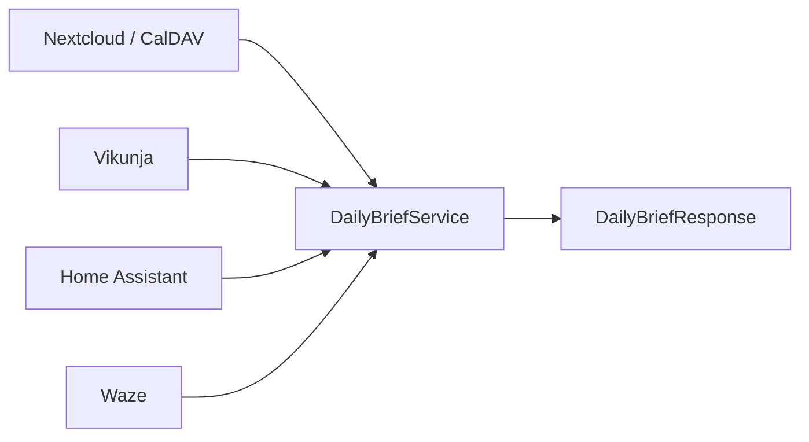

# Daily Brief

`GET /v1/brief/daily` answers “What does Davis need to know right now?” through deterministic, read-only orchestration. It never changes calendars or tasks, schedules work, invokes AI, generates speech audio, forecasts weather, or implements navigation/Alexa behavior.

## Lifecycle

1. Resolve the requested date, defaulting to the current date in `BEACON_TIMEZONE`, and construct the local midnight-to-midnight range.
2. Read all configured CalDAV calendars. Normalize/sort events and split exact-marker Beacon work blocks from ordinary events.
3. List Vikunja tasks. Ignore completed tasks; group overdue and due-today tasks; select highest priority by priority descending, deadline ascending with missing deadlines last, then task ID ascending.
4. If travel is enabled and home is configured, calculate home-to-event estimates/leave-by times for located events and travel feasibility between sequential located events. Failures become warnings.
5. If weather is enabled, read the configured Home Assistant weather entity. Failure becomes a warning.
6. Detect ordinary overlaps, work-block/event overlaps, passed leave-by times, and insufficient sequential travel time. No repair occurs.
7. Build typed structured counts/key items and a deterministic spoken-text summary that omits empty sections.

Calendar and Vikunja failures are isolated: their sections become empty and the response contains warnings. Unexpected orchestration failures map to `502`.

## Travel boundary

`WazeClient` wraps pinned `WazeRouteCalculator==0.16` and returns Beacon `TravelEstimate` models. The dependency uses Waze Live Map endpoints, not an officially supported server API; it can break independently. This risk is contained inside the client and degrades the brief to warnings.

Leave-by time equals event start minus Waze duration minus `DAILY_BRIEF_TRAVEL_BUFFER_MINUTES`. Sequential travel compares the preceding event end plus Waze duration with the next event start.

## Current limitations

- Brief generation is request-driven; there is no background delivery.
- Travel uses free-text calendar locations and home location; quality depends on Waze resolution.
- Only one Home Assistant weather entity is read; Beacon does not forecast.
- Events without locations have no travel estimate.
- Warnings are returned but not persisted or retried.
- Conflict detection is informational and does not consider setup/teardown beyond configured travel buffer.
