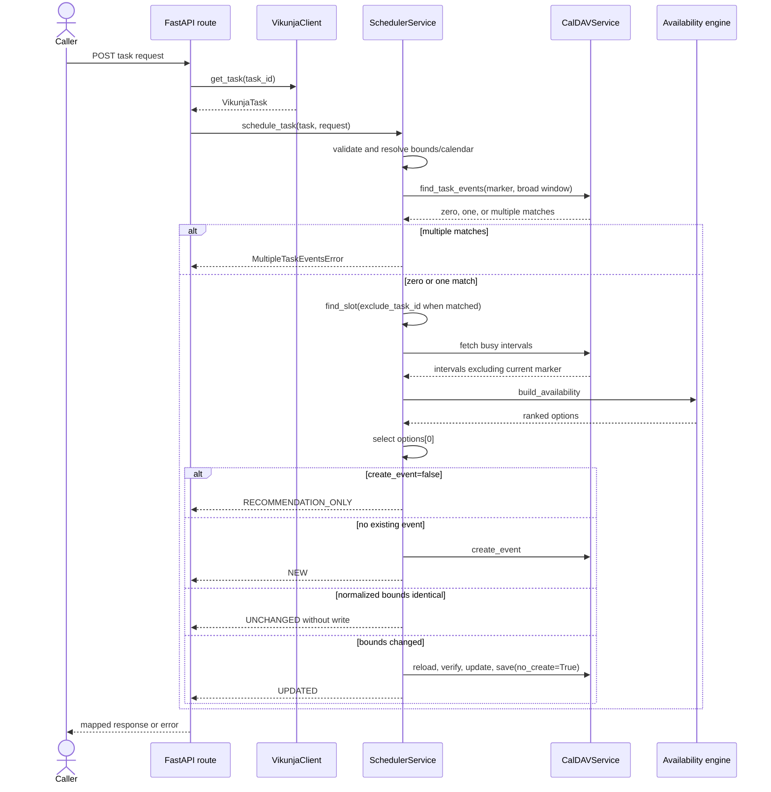
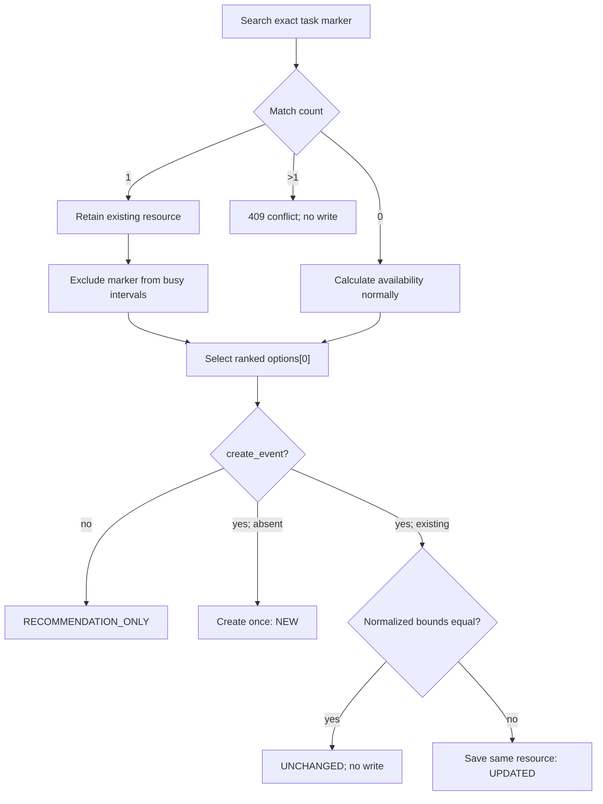

# Scheduling lifecycle

`POST /v1/schedule/task/{task_id}` delegates deterministic lifecycle decisions to `SchedulerService.schedule_task`. `find_slot` remains the availability boundary. See [API reference](api-reference.md), [Availability engine](availability-engine.md), and [Integrations](integrations.md).

The same scheduler is used by `POST /interact` after intake has produced a
concrete Vikunja task and `ScheduleTaskRequest`. The CLI never invokes this
service directly; it uses the HTTP API.



## Exact stages

1. FastAPI validates the request/API key. The route retrieves the normalized Vikunja task and calls the scheduler.
2. The scheduler rejects completed tasks. Earliest is the request value or current Beacon-local time; deadline is the request value or task due date.
3. Destination is `request.calendar_name` or `BEACON_SCHEDULE_CALENDAR`.
4. It searches destination descriptions from earliest minus 365 days through deadline plus 365 days for `Vikunja task ID: <id>`.
5. More than one match raises a conflict; none is a new lifecycle; one is retained as the update target.
6. `find_slot` fetches busy intervals and builds up to 10 ranked options. With a target, the task marker is omitted from busy intervals. The scheduler selects `availability.options[0]`.
7. `create_event=false` returns `RECOMMENDATION_ONLY` and never writes.
8. With no match, Beacon creates `Work Block — <task title>` with marker/priority description and returns `NEW`.
9. With a match, existing and selected bounds are converted to `BEACON_TIMEZONE` and compared as instants and duration. Exact equality returns `UNCHANGED` without a write.
10. Changed bounds trigger an in-place update: reload; verify VEVENT, exact-line marker, UID, and Beacon's `DTEND`-based event shape; replace only `DTSTART`/`DTEND`; save with `no_create=True, increase_seqno=False`; return `UPDATED`. A `DURATION`-based event is rejected without writing.

## Bounds and calendars

`_resolve_bounds` rejects completed tasks before calendar reads. Earliest defaults
to `datetime.now(BEACON_TIMEZONE)` and deadline defaults to the Vikunja due date.
No task/request deadline raises `MissingDeadlineError`. Ordering (`deadline >
earliest`) is enforced when the scheduler constructs `AvailabilityRequest`.

The destination calendar and busy calendars are independent:

- destination: `request.calendar_name` or `BEACON_SCHEDULE_CALENDAR`;
- busy inputs: `request.availability_calendars` or `BEACON_CALENDARS`.

The destination may also be one of the busy calendars. During an update, the
existing exact-marker event is excluded from busy results across the selected
calendars so it does not block itself.

Scheduling uses request daily window values and 15-minute before/after buffers by
default. It asks the engine for up to 10 candidates but always selects the first
ranked option. `NoAvailabilityError` is raised when there are no candidates;
there is no fallback that ignores conflicts or shortens the requested duration.

## Work-block representation

New events use:

```text
Summary: Work Block — <task title>
Description:
Scheduled by Beacon

Vikunja task ID: <id>
Priority: <priority>
```

Priority is recorded for context but does not affect availability scoring.
Existing event summary/description/priority text is not rewritten during a
reschedule; only its bounds change.



Updates preserve UID, href, calendar, summary, description, exact marker line, alarms, sequence, and unrelated properties; only `DTSTART`/`DTEND` change. `already_scheduled` remains for compatibility, while `status` is authoritative. There is no watcher: changes take effect only on another scheduling request. Search/update remains non-transactional and linkage still depends on editable descriptions.

## Recommendation semantics

`create_event=false` still performs task validation, marker lookup, busy reads,
and deterministic selection. It returns `RECOMMENDATION_ONLY` before any create
or update call. If one existing marker was found, `calendar_event` contains it
and `already_scheduled` is true; otherwise those values are null/false. Multiple
existing markers remain a conflict even in recommendation mode because Beacon
will not silently accept ambiguous lifecycle state.

## Idempotency and race limitations

Sequential requests are usually idempotent through exact-marker lookup and
normalized-bound comparison. This is best-effort rather than transactional:

- two simultaneous requests can both search before either creates;
- manual marker edits or moving the event can make it undiscoverable;
- lookup is only in the chosen destination and a finite ±365-day range;
- choosing a different destination can create another linked block;
- a resource can disappear/change between lookup and update, producing a typed
  failure rather than recreating it silently.

Beacon has no background watcher. Vikunja due-date or priority changes affect a
work block only when another scheduling request causes recalculation.
