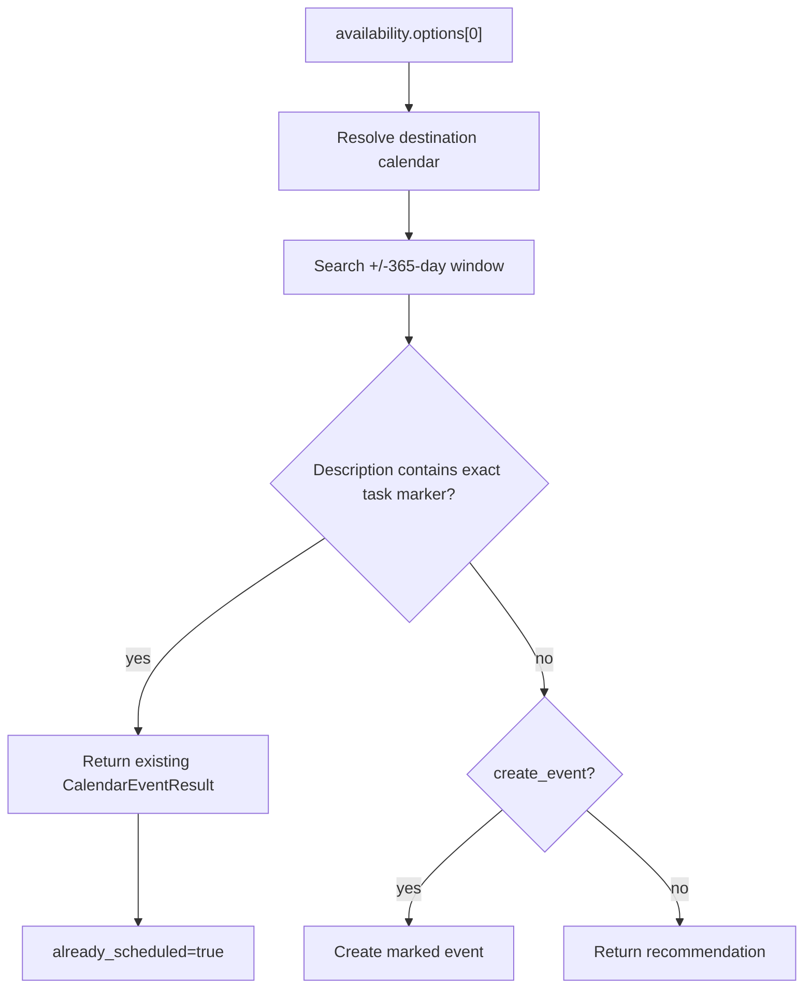
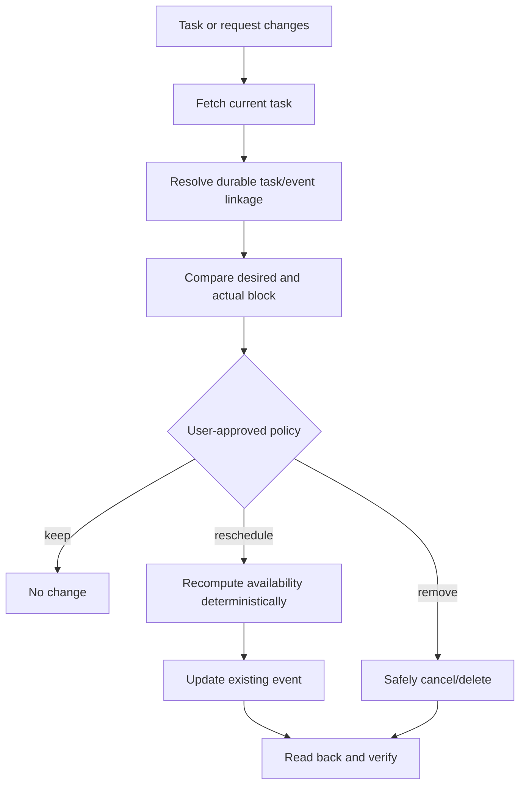

# Scheduling lifecycle

This is the exact behavior of `POST /v1/schedule/task/{task_id}`. See [API reference](api-reference.md), [Availability engine](availability-engine.md), and [Integrations](integrations.md).

```mermaid
sequenceDiagram
    actor Caller
    participant R as Scheduling route
    participant V as VikunjaClient
    participant S as SchedulerService
    participant C as CalDAVService
    participant A as Availability engine
    participant N as Nextcloud
    Caller->>R: POST /v1/schedule/task/{task_id}
    R->>V: get_task(task_id)
    V-->>R: VikunjaTask
    R->>S: find_slot(task, request)
    S->>S: validate; resolve earliest/deadline
    S->>C: fetch_busy_intervals
    C->>N: search calendars
    C-->>S: BusyInterval list
    S->>A: build_availability
    A-->>R: AvailabilityResponse via S
    R->>R: select availability.options[0]
    R->>R: resolve destination calendar
    R->>C: find_task_event(marker, +/-365 days)
    alt marker found
        C-->>R: existing event
        R-->>Caller: already_scheduled=true
    else absent and create_event=true
        R->>C: create_event
        C->>N: add VEVENT
        R-->>Caller: status=scheduled
    else absent and create_event=false
        R-->>Caller: status=recommended
    end
```

## Exact stages

1. FastAPI validates `task_id`, API key, and `ScheduleTaskRequest`.
2. `VikunjaClient.get_task` retrieves and normalizes the task.
3. `SchedulerService.find_slot(task, request)` rejects completed tasks.
4. Earliest is `request.earliest_iso` or current time in `BEACON_TIMEZONE`.
5. Deadline is `request.deadline_iso` or `task.due_date`; neither raises `MissingDeadlineError`.
6. The scheduler builds `AvailabilityRequest`, carries duration, buffers, calendars, and daily window, and sets `max_options=10`.
7. It fetches busy intervals, builds availability, and raises `NoAvailabilityError` when empty.
8. The route selects `availability.options[0]`.
9. Destination is `request.calendar_name` or `BEACON_SCHEDULE_CALENDAR`.
10. It searches that calendar from selected start minus 365 days to selected end plus 365 days for `Vikunja task ID: <id>` in descriptions.
11. A match returns status `already_scheduled`, the event, and `already_scheduled=true`; nothing is updated.
12. Otherwise, if `create_event=true`, it creates `Work Block — <task title>` at the chosen bounds with:

```text
Scheduled by Beacon

Vikunja task ID: <id>
Priority: <priority>
```

13. Creation returns `scheduled`; `create_event=false` returns `recommended`. Both set `already_scheduled=false`.



Idempotency is marker-based, calendar-local, finite-window, and non-atomic. Changing destination calendars can permit another event.

## Future update lifecycle (not implemented)



No update, deletion, watcher, reconciliation, or recovery code currently exists.
